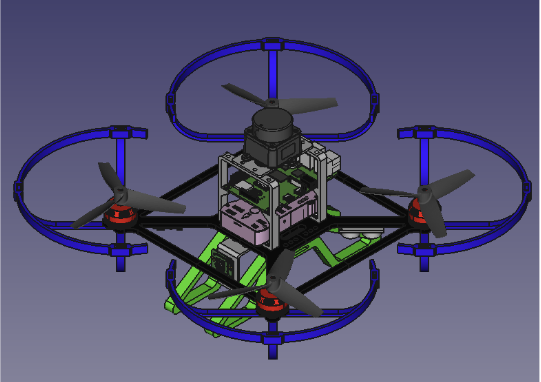

# deltahigh_cbr_2024
Repositório Público para CBR 2024

O Team Description Paper (TDP) pode ser acessado em: [TDP](./DeltaHighTDP2024)

Os arquivos para impressão 3D dos drones podem ser obtidos em:
[Drone Robô Q450](./Drone_Q450) para o drone 450 mm (foto abaixo)

[Drone Robô Q260](./Drone_Q260) para o drone 260 mm (foto abaixo)

