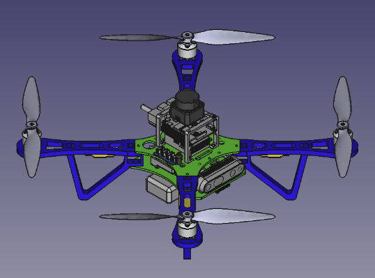
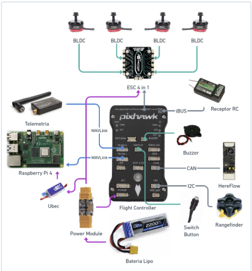
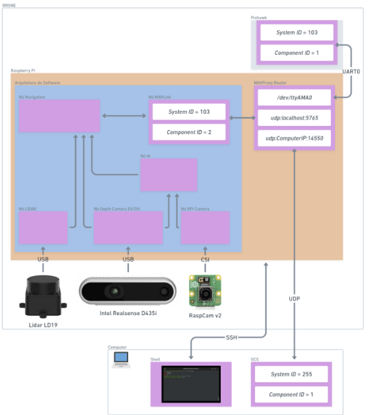

# deltahigh_cbr_2024
Repositório Público para CBR 2024

O Team Description Paper (TDP) pode ser acessado em: [TDP](./DeltaHighTDP2024.pdf)
O vídeo de qualificação para a CBR 2024 pode ser acessado em: [Qualificação para Competição Brasileira de Robótica (CBR) 2024](https://www.youtube.com/watch?v=VKMqZ2ehRco)

Os arquivos para impressão 3D do Drone Q450 podem ser obtidos em
[Drone Robô Q450](./Drone_Q450) 

Os arquivos para impressão 3D do Drone Q260 podem ser obtidos em
[Drone_Q260](./Drone_Q260)

A arquitetura de hardware e de software utilizadas pela equipe estão nas figuras abaixo

